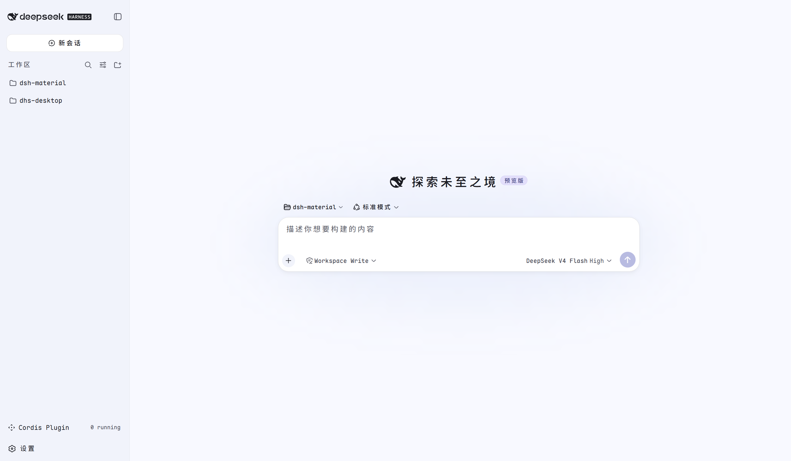

# dsh-material

**Material You / Material 3 皮肤** for [DeepSeek Harness](https://github.com/deepseek-ai/deepseek-harness)（DSH）。

配色由 **Material Color Utilities 的 HCT 算法** 从种子色推导成色调色板，
字体采用 **Maple Mono NF CN**（Nerd Font + 中文等宽）。浅色模式为清爽的
**蓝白**配色（种子色 `#3B82F6`，HCT 色相 266°）。



## ✨ 特性

| 维度 | 取值 |
| --- | --- |
| 种子色 | `#3B82F6`（HCT 色相 266.3，干净科技蓝） |
| 调色板模型 | HCT（Hue–Chroma–Tone），tone 0–100 |
| 色板数量 | 5 条：primary / secondary / tertiary / neutral / neutral-variant |
| 字体 | Maple Mono NF CN（family name `"Maple Mono NF CN"`） |
| 动效 | M3 emphasized/standard 缓动，支持 `prefers-reduced-motion` |
| 形状 | M3 圆角体系（4/8/12/16/28/full px） |

## 🚀 安装到 DSH

```bash
# 从本仓库目录安装（file: 依赖；也可发布到 npm 后直接加包名）
dsh plugin --profile web add "file:/绝对/路径/到/theme-material-you"
```

安装后重启 `dsh web` 生效：`system` 偏好下两种外观均为 Material You 配色；
设置 → 外观里可选 `material-you-light` / `material-you-dark` 固定主题。

卸载：`dsh plugin --profile web remove @deepseek-ai/dsh-skin-material-you`

## 📦 项目结构

```
dsh-material/
├── LICENSE             # MIT
├── demo.png            # 主题展示截图
├── docs/
│   └── dsh-skin-development.md   # DSH 皮肤开发参考文档
└── theme-material-you/           # 主题插件包
    ├── build.mjs       # 构建脚本：src/ → lib/client.js
    ├── src/            # 源文件（tokens.mjs / client.js / css）
    ├── lib/            # 构建产物（DSH 实际加载）
    └── fonts/          # 自托管 Maple Mono woff2
```

## 🎨 换种子色

1. 用 HCT 生成器（material-color-utilities）从新种子生成五条色板。
2. 替换 `theme-material-you/src/tokens.mjs` 里的色板常量。
3. 同步 `theme-material-you/src/palette.css` 参考值。
4. `node theme-material-you/build.mjs` 重新构建。

详见 [`theme-material-you/README.md`](theme-material-you/README.md) 与
[`docs/dsh-skin-development.md`](docs/dsh-skin-development.md)。

## 📄 License

[MIT](LICENSE)
